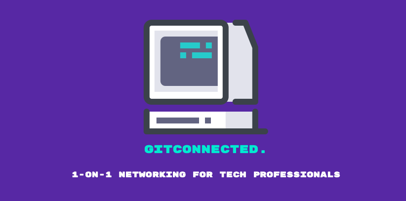
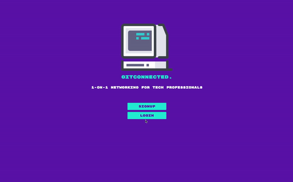
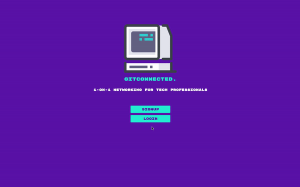
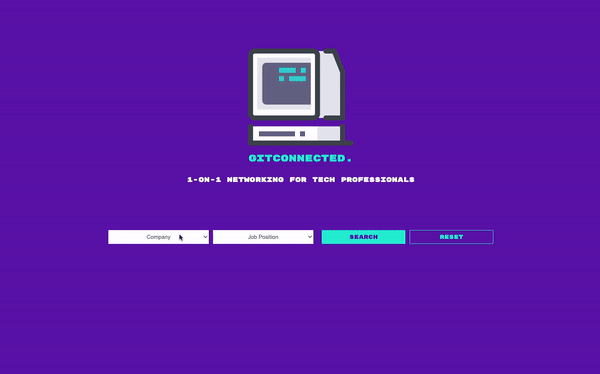

 

## Overview

In the era of covid, the opportunity to network professionally has been significantly diminished. Networking events, conferences, talks, workshops, meetups, informational interviews, hackathons, etc. all have moved online or have completely disappeared in 2020. These online events are great, but they are not just the same when it comes to professional networking. There is no longer a way to meet like-minded people who are actually interested in meeting us to help us grow ourselves and our networks.

That’s why we created GitConnected. What sets GitConnected apart from other apps like LinkedIn is everyone who signs up is an active participant: they all want to meet other like-minded people. How many times have you sent or received a connection request on LinkedIn from a complete stranger who you never hear from again? To get connected, users create profiles and log in to search people they’re interested in meeting, just like we already do on LinkedIn, however, unlike LinkedIn, people on GitConnected actually want to meet and network with you. 

We want to bring 1-on-1 professional networking online and help people connect through genuine, authentic meetings based on professional backgrounds, interests and aspirations.

We’ve set up the basic database for users, companies, and tech interests. We want people to be able to connect with people based on tech interests: say, someone is interested in meeting a product designer in the financial technology industry or a software engineer in the blockchain industry. 

Our current features are just creating a user profile and searching people based on jobs and/or companies. 

 

## Beta Stage

Team GitConnected will strive to continuously release updates and additional features.

1. If you would like to contribute to this project:

   - Please feel free to <a href="https://github.com/gconnected/Git-Connected/pulls">submit a PR</a>

2. If you happen to come across any issues while tinkering with the application:
   - Please <a href="https://github.com/gconnected/Git-Connected/issues">report the bug/issue</a> by submitting a ticket located in the Issues Tab within this repository

 

## Getting Started

1.  Clone GitConnected to your local machine and point to the Git-Connected directory:

        git clone https://github.com/gconnected/Git-Connected.git

        cd Git-Connected

2.  Install all required dependencies with the following script:

        npm install

3.  Run the following script to open Git Connected on http://localhost:8080:

        npm run dev

 

## Main Features

### User Register / Login Landing Page

Users will be greeted with a landing page that will allow first-time users to register an account or returning users to login to access Git Connected's features.

 

First-time users that register on Git Connected will be led to a profile setup page that will request the user to input their information so that their data can be stored in the database. This will allow other networking professionals to be able to search for the new user from the Search Bar Page.

 

### Networking Search Bar Page

After signing in or registering, the user will have access to the search bar and will be able to look up any available networking professionals based on two requirements: <strong>Company Name & Job Title</strong>

	

 

## Built With

- React
- Node.JS
  - Express
- PostgreSQL

 

## Core Team

<a href="https://github.com/morgan562">Tyler Morgan</a>
 
<a href="https://github.com/tysong24">Tommy Song</a>
 
<a href="https://github.com/nicholasjs">Nicholas Shay</a>
 
<a href="https://github.com/sophiapak">Sophia Pak</a>

 

## License

This project is licensed under the MIT License
